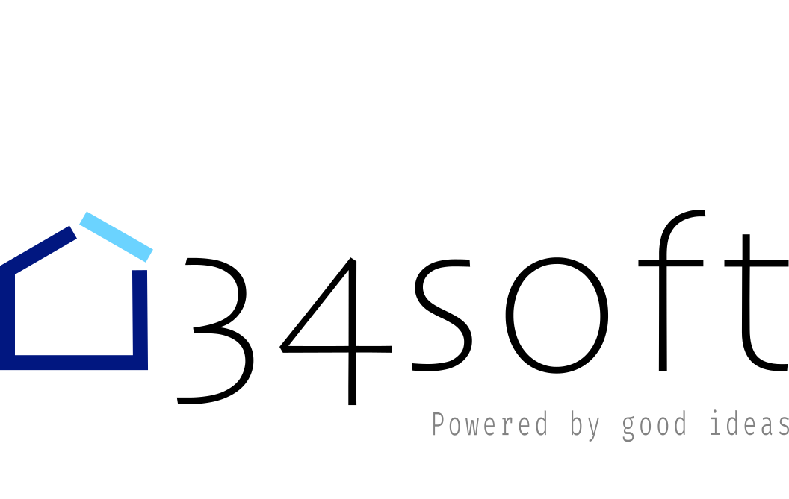

<p align="center">
  <a href="http://34s0ft.com/" target="blank"></a>
</p>

## Description

Application that implements a chat app backend in nestjs using websocket

## Installation

```bash
$ npm install
```

## Running the app

```bash
# development
$ npm run start

# watch mode
$ npm run start:dev

# production mode
$ npm run start:prod
```

## Test

```bash
# unit tests
$ npm run test

# e2e tests
$ npm run test:e2e

# test coverage
$ npm run test:cov
```

## Stay in touch

- Author - [Nevardo]
